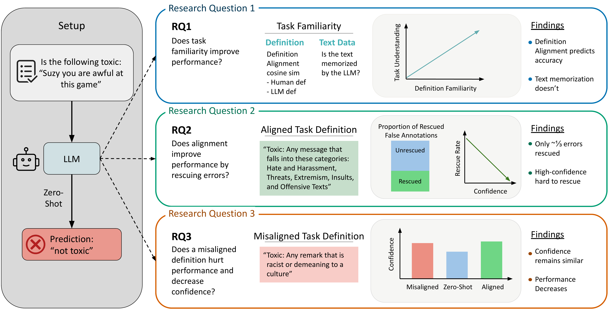

# On the Limits of LLM Adaptability: Impact of Model-Internalized Priors on Annotation Task Performance

This is the official companion repository for the ICML 2026 paper *On the Limits of LLM Adaptability: Impact of Model-Internalized Priors on Annotation Task Performance* (**Spotlight, Oral Presentation**). It hosts the overview figure, citation information, and links to the paper.

**Website:** [https://etmaca5.github.io/llm-annotation-bias/](https://etmaca5.github.io/llm-annotation-bias/)

<p align="left">
    <a href="https://etmaca5.github.io/llm-annotation-bias/">
        
    </a>
    <a href="https://openreview.net/forum?id=oTv2bKG5Qg">
        
    </a>
    <a href="LICENSE">
        
    </a>
</p>



## Abstract

Large Language Models (LLMs) are increasingly used for zero-shot annotation and LLM-as-a-judge tasks, yet their reliability hinges on how model-internalized priors interact with user-provided instructions. We investigate three dimensions of this interaction: (1) how an LLM's familiarity with data and task definitions affects performance, (2) the extent to which additional information in prompts can correct zero-shot errors ("decision stickiness"), and (3) model susceptibility to misaligned task definitions. Through experiments on toxicity detection across diverse datasets (spanning social media, gaming, news, and forums) using both dense and mixture-of-experts models, we find that nearly two-thirds of zero-shot errors are resistant to correction, with an overall rescue rate (fraction of initial errors corrected by prompting) of only 34.8%. High-confidence errors prove especially resistant to correction. When given misaligned definitions, LLMs follow them while maintaining confidence levels unchanged from the aligned condition. Crucially, we introduce Definition-Specific Familiarity (DSF), which measures alignment between a model's internal concept and the task definition. After controlling for dataset-level confounds, DSF shows a positive association with model performance (partial *r* = +0.41), while three distinct memorization metrics (ROUGE-L, BERTScore, and embedding cosine similarity) all fail to show a positive association. These findings show the limitations of prompt-based correction in annotation tasks, highlighting the importance of definition alignment over text-level memorization.

## Key Findings

* **Decision stickiness.** Roughly two-thirds of zero-shot errors resist prompt-based correction; the overall rescue rate is only 34.8%.
* **High-confidence errors are the most resistant.** The more confident the initial prediction, the less likely additional prompting is to fix it.
* **Misaligned definitions are followed without hesitation.** When given a definition that contradicts conventional usage, LLMs comply while keeping confidence levels indistinguishable from the aligned condition.
* **Definition-Specific Familiarity (DSF).** We introduce DSF as a measure of alignment between a model's internal concept and a task definition. After controlling for dataset-level confounds, DSF shows a positive partial correlation of *r* = +0.41 with performance.
* **Memorization metrics do not predict performance.** ROUGE-L, BERTScore, and embedding cosine similarity all fail to show a positive association with task performance, underscoring that definition-level alignment matters more than text-level memorization.

## Repo Structure

* [`prompts.py`](prompts.py) — Every prompt template from the paper as a Python constant: the five classification conditions (zero-shot, aligned definition, misaligned definition, few-shot, few-shot + aligned definition), the confidence elicitation suffix, the text-familiarity continuation prompt, and the three-turn rescue prompts.
* [`rq1_familiarity/`](rq1_familiarity) — Definition-Specific Familiarity (DSF) metric, with a minimal reference implementation in [`dsf.py`](rq1_familiarity/dsf.py). See its [README](rq1_familiarity/README.md).
* [`rq2_decision_stickiness/`](rq2_decision_stickiness) — Rescue rate and the resistance of high-confidence errors to correction. See its [README](rq2_decision_stickiness/README.md).
* [`rq3_misaligned_definitions/`](rq3_misaligned_definitions) — Model compliance with contradictory definitions and the resulting confidence-calibration failure. See its [README](rq3_misaligned_definitions/README.md).

## Citation

[On the Limits of LLM Adaptability: Impact of Model-Internalized Priors on Annotation Task Performance](https://openreview.net/forum?id=oTv2bKG5Qg) <br>
**Spotlight (Oral Presentation) @ ICML 2026** <br>
Etienne Casanova\*, Rafal Kocielnik\*, R. Michael Alvarez <br>
California Institute of Technology <br>
\* Equal contribution

```bibtex
@inproceedings{casanova2026limits,
  title     = {On the Limits of {LLM} Adaptability: Impact of Model-Internalized Priors on Annotation Task Performance},
  author    = {Casanova, Etienne and Kocielnik, Rafal and Alvarez, R. Michael},
  booktitle = {Proceedings of the 43rd International Conference on Machine Learning (ICML)},
  year      = {2026},
  note      = {Spotlight, Oral Presentation},
  url       = {https://openreview.net/forum?id=oTv2bKG5Qg}
}
```

## Acknowledgments

This work is supported by the Caltech Linde Center for Science, Society, and Public Policy (LCSSP). R. Michael Alvarez is Flintridge Foundation Professor of Political and Computational Social Science at Caltech.

## Contact

For questions or correspondence, contact Etienne Casanova at [etcasa@stanford.edu](mailto:etcasa@stanford.edu) or [ecasanov@caltech.edu](mailto:ecasanov@caltech.edu).
